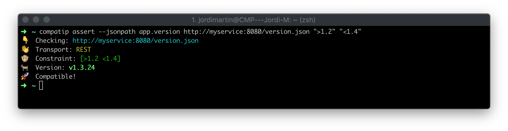
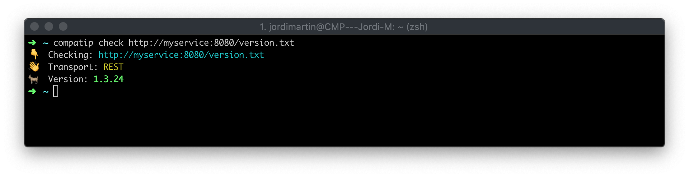
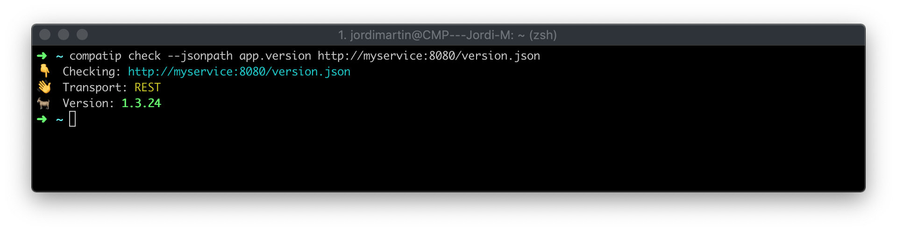
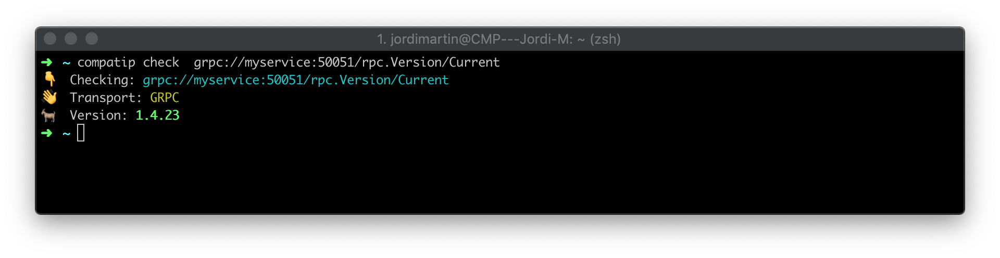
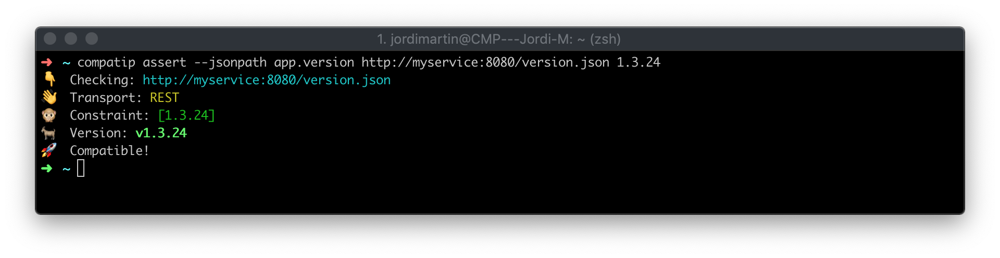
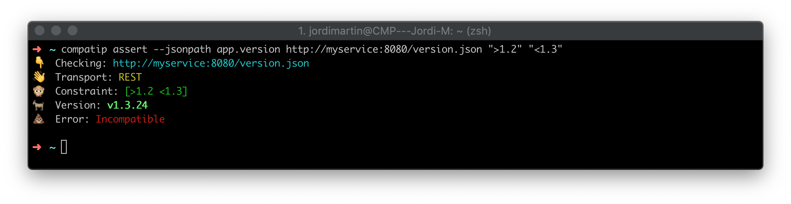

# Compatip

`Compatip` it's a simple tool to ensure compatibility between microservices.

## Description

`Compatip` has been designed as a part of the checks that you should run in your CI/CD pipeline.

With `Compatip` you can specify the service you want to check and the version constraints you would like to validate. In case of incompatibility, the application will fail with a recognizable error code.

So far, `Compatip` supports REST and gRPC+Protobuf communications, Semver semantics (MAJOR.MINOR.PATCH) to ensure the compatibility between services and it's also able to use JSON dot notation to extract the version from the service response.

## TL;DR



## Usage
    
#### Check Command

Checks the current version of the service.

Example:
`compatip check --jsonpath app.version http://myservice:8080/version.json`

**Exit codes:**

0: All Ok.<br>
2: Input argument error.<br>
3: Error on server communication.<br>
4: Invalid version response.<br>

#### Assert Command

Asserts the current version of the service with the specified constraints.

Example:
`compatip assert grpc://myservice:50051/rpc/versionservice/current ">1.4.10"`

Exit codes:

0: All Ok. <br>
1: Incompatible service version.<br>
2: Input argument error.<br>
3: Error on server communication.<br>
4: Invalid version response.<br>

## Examples

#### Check service version

HTTP (GET verb) request to the service:



Extracting the version from json:

Server response:
```json
{
   "app": {
      "version" : "v1.3.24"
   }
}
```



gRPC request to the service:




Due the nature the protobuf the service should answer with this very same message format.

```protoc
message VersionMessage {
  string version = 1;
}
```

#### Assert service version

Assert exact version:



Assert version range:

Greater than `1.2`:


Greater than `1.2` and lower than `1.4`:


Uncompilable range:




## Install

To install, use `go get`:

```bash
$ go get -d github.com/jmartin82/jmartin82
```

## Installation

### Binary Release (Linux/OSX)

You can manually download a binary release from [the release page](https://github.com/jmartin82/compatip/releases).

Automated install/update, don't forget to always verify what you're piping into bash:

```sh
curl https://raw.githubusercontent.com/jmartin82/compatip/master/scripts/install_compatip.sh | bash
```

### Go

Required go version: 1.12

```sh
go get github.com/jmartin82/compatip
```


## Contribution

1. Fork ([https://github.com/jmartin82/compatip/fork](https://github.com/jmartin82/compatip/fork))
1. Create a feature branch
1. Commit your changes
1. Rebase your local changes against the master branch
1. Run test suite with the `go test ./...` command and confirm that it passes
1. Run `gofmt -s`
1. Create a new Pull Request

## Author

[jmartin82](https://github.com/jmartin82)
